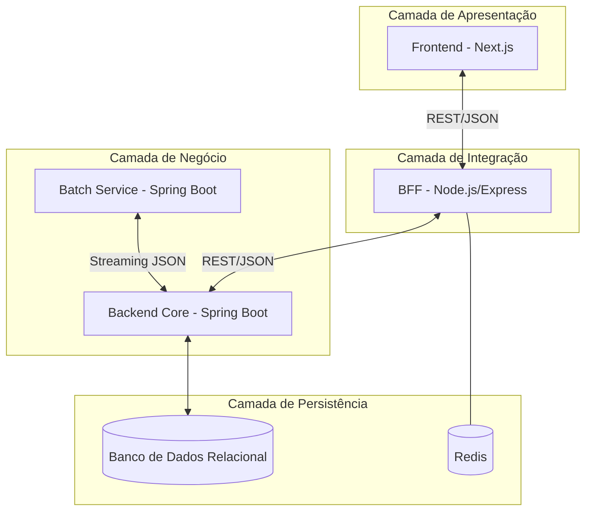
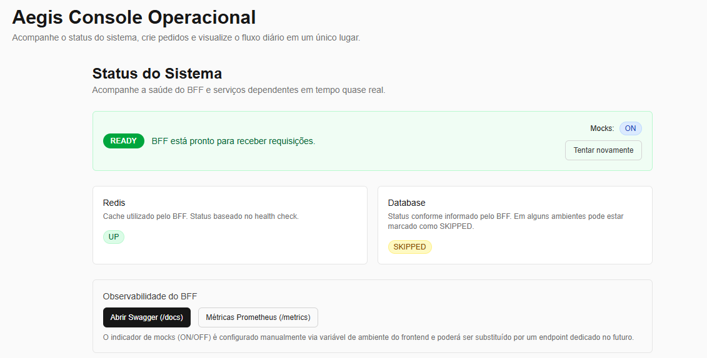
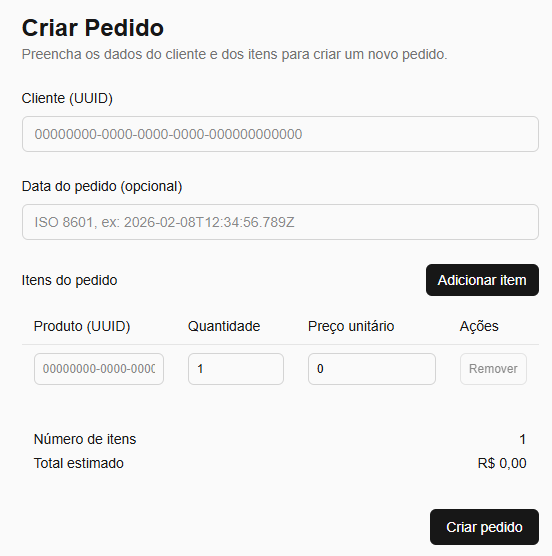
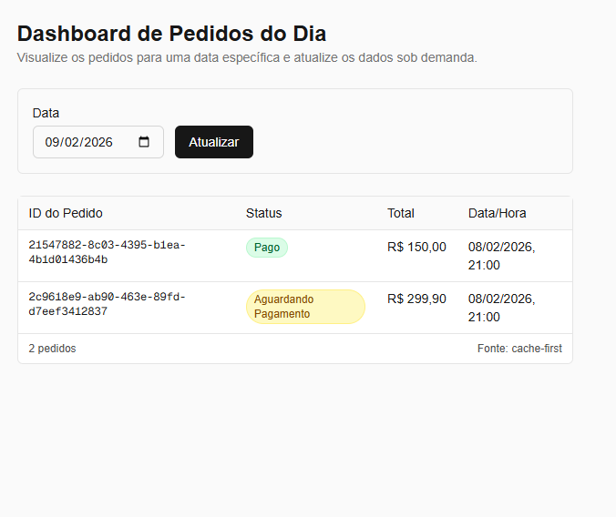
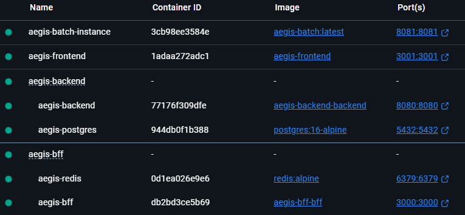

# Aegis Financial Architecture

Esta documentação descreve a especificação técnica e a estrutura de diretórios do ecossistema Aegis, um sistema distribuído projetado para gestão, processamento e monitoramento de transações financeiras.

## Visão Geral

O Aegis Financial Architecture é uma plataforma voltada para o processamento transacional diário, garantindo a integridade dos dados, a segregação de responsabilidades e a observabilidade operacional. O sistema resolve a complexidade de lidar com grandes volumes de dados financeiros através de uma arquitetura desacoplada, permitindo que operações de interface, regras de negócio centrais e processamento pesado de dados em lote (batch) evoluam de forma independente e segura.

O projeto foca em três pilares fundamentais:

1. **Consistência Transacional:** Garantia de integridade em todas as operações financeiras.
2. **Escalabilidade Modular:** Divisão de serviços com base em domínios de responsabilidade.
3. **Eficiência em Lote:** Processamento de fechamento diário otimizado para baixo consumo de memória.

## Arquitetura do Sistema

A solução utiliza uma topologia de microserviços/serviços distribuídos para garantir que a lógica de negócio esteja isolada das interfaces de consumo.

### Componentes e Responsabilidades

* **Frontend (React/Next.js):** Interface de gestão operacional voltada para o monitoramento de saúde do sistema, visualização de indicadores e administração de pedidos.
* **BFF (Node/Express):** Atua como orquestrador e agregador de dados para a interface. Implementa validação de esquemas (Zod), gestão de sessões e abstração de contratos complexos do backend core.
* **Backend Core (Spring Boot):** O núcleo transacional que detém as regras de domínio, persistência em banco de dados relacional e exposição de APIs de alta disponibilidade.
* **Batch Service (Spring Boot):** Módulo especializado em processamento de dados históricos e fechamento de ciclos financeiros (D-1). Utiliza técnicas de streaming para processar grandes conjuntos de dados sem sobrecarregar a memória heap da JVM.

## Principais Funcionalidades

* **Gestão de Pedidos:** Fluxo completo de criação, validação e persistência de transações financeiras.
* **Monitoramento Operacional:** Dashboard centralizado para verificação de status de saúde (health checks) de todos os serviços e dependências (Bases de dados, Redis).
* **Liquidação Diária (Batch):** Processamento automatizado para consolidação de relatórios e fechamento de saldo diário.
* **Validação de Contratos:** Garantia de integridade de dados entre camadas via validação rigorosa de payloads.

## Decisões Técnicas e Observações Relevantes

### Desacoplamento via BFF

A introdução da camada de BFF (Backend for Frontend) foi decidida para proteger o Backend Core de requisitos específicos de UI. Isso permite que a interface evolua rapidamente sem a necessidade de alterações constantes nas APIs de domínio, além de facilitar a implementação de mecanismos de cache e composição de dados de múltiplas fontes.

### Clean Architecture no Core

O Backend Core segue princípios de Clean Architecture, isolando a lógica de negócio (Domain/Application) das tecnologias de infraestrutura. Isso garante que o sistema seja testável e resiliente a trocas de frameworks ou drivers de banco de dados.

### Processamento de Dados via Streaming

Para evitar gargalos de performance e consumo excessivo de memória, o serviço Batch consome dados do Backend Core via streaming JSON. Esta abordagem permite o processamento de milhares de registros de forma sequencial e eficiente, mantendo a estabilidade do ambiente de produção durante o fechamento financeiro.

### Encapsulamento de Dados

O serviço Batch não possui acesso direto à base de dados do Backend Core. Toda a comunicação é realizada via APIs, respeitando o princípio de encapsulamento e garantindo que apenas o Core tenha autoridade sobre a persistência dos dados transacionais.

## Galeria do Projeto

|        Início do fluxo de pedido         |        Criar pedidos        |
|:-----------------------------:|:----------------------:|
|     |  |

|       Fechamento do Dia       |        Docker        |
|:--------------------------------:|:----------------------:|
|  |  |

